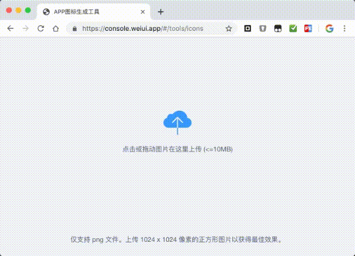
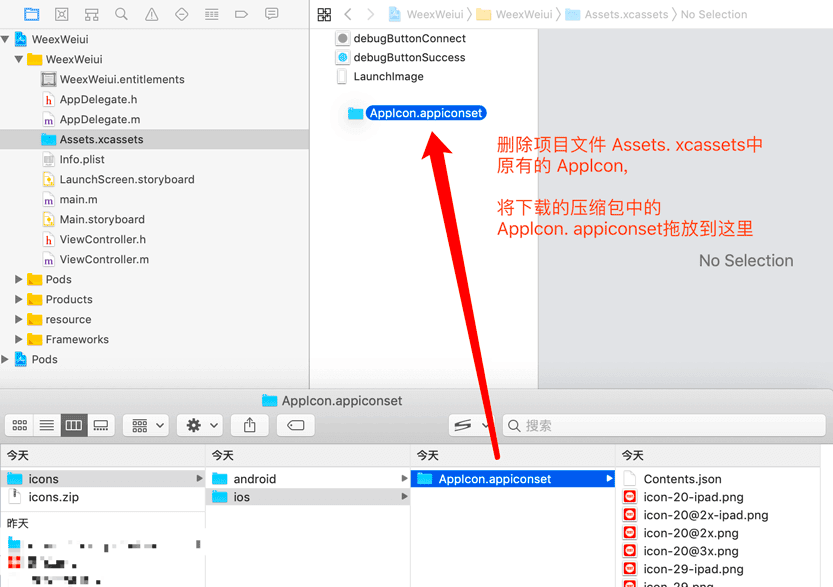

# 应用图标

## 生成新图标

打开图标生成工具[https://console.weiui.app/#/tools/icons](https://console.weiui.app/#/tools/icons)上传并生成图片

## 修改iOS图标

> iOS覆盖路径为：platforms/ios/WeexWeiui/WeexWeiui/Assets.xcassets/

## 修改Android图标

> Android覆盖路径为：platforms/android/WeexWeiui/app/src/main/res/

