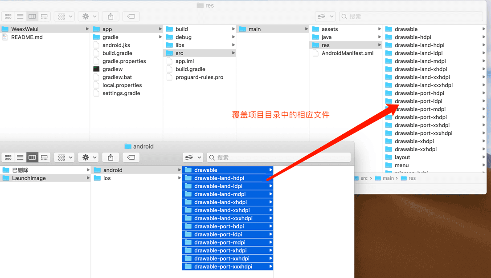

# 启动图片

## 生成启动图

打开启动图生成工具[https://console.weiui.app/#/tools/launchimage](https://console.weiui.app/#/tools/launchimage)上传并生成启动图

<a href="https://console.weiui.app/statics/video/demo.mp4" target="target">查看制作视频教程▶️</a>

## 修改iOS启动图

> iOS覆盖路径为：platforms/ios/WeexWeiui/WeexWeiui/Assets.xcassets/LaunchImage.launchimage/

## 修改Android启动图

> Android覆盖路径为：platforms/android/WeexWeiui/app/src/main/res/drawable-xxxx-xxxxx/

