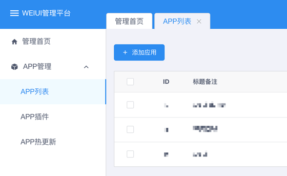
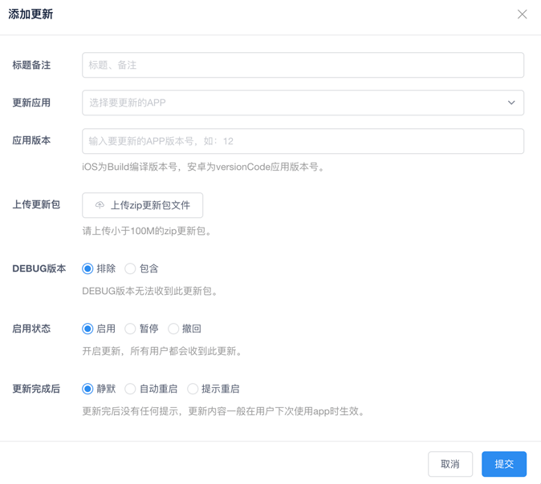

# 热更新

## 功能介绍

热更新（修复）可以实现快速版本迭代，快速修复bug。不用发布新的apk或者ipa版本（只要把您改动的`页面`、`config配置`、`图片`上传）既可对你的app进行更新。

## 注册绑定

#### 1、登录注册

点击链接进入 [weiui APP管理中心](https://console.weiui.app/#/manage/) 即可一键注册登录。

#### 2、添加应用

注册登录后进入面板，依次点击左侧`APP管理`&gt;&gt;`APP列表`&gt;&gt;`添加应用`。如下图：

#### 3、新增热更新

点击左侧`APP热更新`&gt;&gt;`添加更新`，按需填写上传zip更新包即可。如下图：

::: tip

zip更新包目录结构说明：将要更新的文件直接打包成zip压缩包即可。

例如：你改了一个`demo.vue`文件，你只要将`demo.vue`build生成的对应文件`demo.js`打包上传即可，当然你也可以把所有js文件都打包上传。

:::